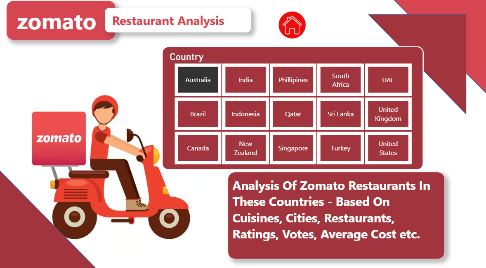
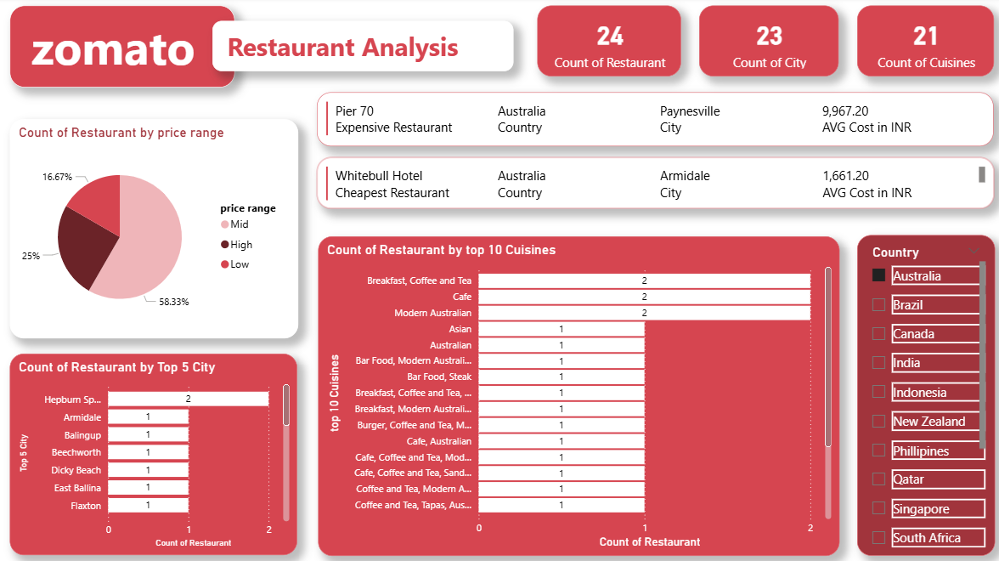
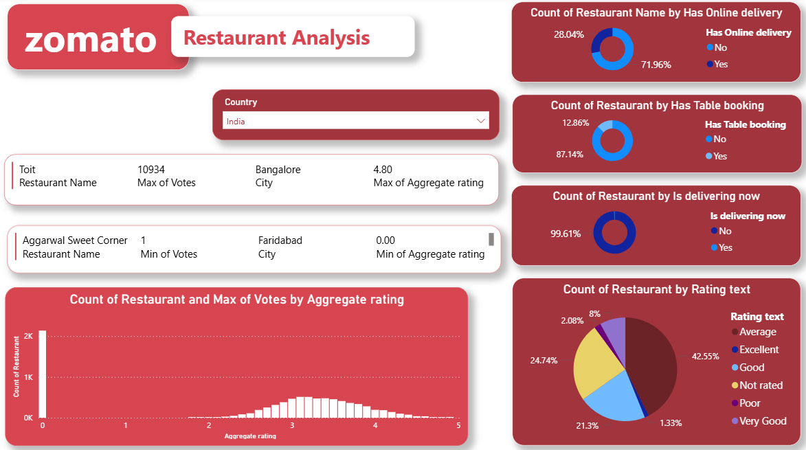

# 🍽️ Zomato Restaurant Analysis – Power BI Project

## 📊 Overview
This project presents a **comprehensive analysis of Zomato restaurant data** across multiple countries using **Microsoft Power BI**.  
It explores various restaurant metrics such as **cuisine types, price ranges, ratings, votes, delivery options, and locations**, offering valuable insights into global dining trends.

---

## 🌍 Objective
The goal of this project is to perform a **data-driven analysis** of Zomato’s restaurant listings across 15 countries and to:
- Identify **top cuisines** and **popular cities** for restaurants.
- Analyze **average cost** variations by location and price range.
- Examine **ratings distribution** and **customer feedback trends**.
- Understand patterns in **online delivery**, **table booking**, and **real-time delivery** options.

---

## 🗺️ Countries Analyzed
The dataset includes restaurant data from the following countries:

| Country | Country | Country |
|----------|----------|----------|
| Australia | Brazil | Canada |
| India | Indonesia | New Zealand |
| Philippines | Qatar | Singapore |
| South Africa | Sri Lanka | Turkey |
| UAE | United Kingdom | United States |

---

## 🧮 Key Metrics & Insights

### 🔹 1. Restaurant Count by Price Range
- **High Price Range:** 20%  
- **Mid Price Range:** 80%  
- Indicates most restaurants target mid-range pricing for affordability and customer reach.

---

### 🔹 2. Top 10 Cuisines
Most popular cuisines across all countries:
1. Indian  
2. International  
3. Pakistani  
4. American / Tex-Mex  
5. Chinese  
6. European / Arabian / Japanese  
7. Italian  
8. Kerala / Indian / Chinese  
9. North Indian / Turkish  
10. Seafood / Steak / Thai  

🍛 *Indian cuisine dominates globally among Zomato listings.*

---

### 🔹 3. Top 5 Cities by Restaurant Count
| Rank | City | Count of Restaurants |
|------|------|----------------------|
| 1 | Doha | 20 |
| 2 | Toronto | 14 |
| 3 | Mumbai | — |
| 4 | London | — |
| 5 | Dubai | — |

📍 *Doha and Toronto have the highest number of listed restaurants.*

---

### 🔹 4. Average Cost Analysis (in INR)
- **Most Expensive Restaurant:** *Vine – The St. Regis* in **Qatar**, Avg. Cost ₹12,545.50  
- **Cheapest Restaurant:** *7st by Mumbai Spices* in **Qatar**, Avg. Cost ₹1,140.50  

💰 *Qatar shows high price diversity in dining options.*

---

### 🔹 5. Rating Distribution
| Rating Text | Percentage |
|--------------|-------------|
| Very Good | 25% |
| Good | 25% |
| Average | 50% |

⭐ *Most restaurants fall under the “Average” rating bracket (3.0 – 3.8).*

---

### 🔹 6. Votes & Ratings Correlation
- Highest-rated restaurant: **Lake House Restaurant** – Rating **4.3**, Votes **204**  
- Lowest-rated restaurant: **Consort Restaurant** – Rating **3.0**, Votes **6**  

📊 *Higher votes generally align with higher ratings.*

---

### 🔹 7. Delivery & Booking Insights
| Feature | Availability |
|----------|--------------|
| Online Delivery | ❌ Not available |
| Table Booking | ❌ Not available |
| Delivering Now | ❌ Not available |

🛵 *Majority of the analyzed restaurants don’t offer online delivery or live booking (possibly due to data limitations).*

---

## ⚙️ Tools & Technologies Used
- **Microsoft Power BI** – For visualization and dashboard creation  
- **Microsoft Excel / CSV Data Source** – Data preprocessing and cleaning  
- **Zomato Dataset** – Public dataset of restaurant listings and attributes  

---

## 📂 Dashboard Overview
The Power BI dashboard contains:
- **Country Filter:** Allows viewing metrics by country  
- **Visuals:**
  - Bar charts for cuisines and city distribution  
  - Pie charts for price ranges and rating categories  
  - Card visuals for top/lowest rated restaurants  
  - KPI indicators for cost, votes, and ratings  

---

## 🧭 Insights Summary
✅ **Indian cuisine** is the most dominant globally.  
✅ **Doha (Qatar)** has the highest number of Zomato-listed restaurants.  
✅ **Mid-range pricing** dominates the global restaurant landscape.  
✅ **Ratings cluster between 3.0–4.3**, showing moderate customer satisfaction.  
✅ Lack of **online delivery** and **table booking** suggests limited digital integration in many regions.

---

## 🚀 Future Improvements
- Integrate **real-time Zomato API** data for dynamic dashboards.  
- Add **geo-mapping visuals** for better location-based insights.  
- Compare restaurant ratings against **cost ranges** and **cuisines**.  
- Use **Power BI DAX measures** for deeper KPI analytics (e.g., average votes per cuisine).

---

## 🧑‍💻 Author
**Palak Katoch**  
📧 [katoch.palak0123@example.com]  
🌐 [https://linkedin.com/in/palakkatoch4/] 
🌐 [https://github.com/palakdataworks]
📊 *Data Analyst | Power BI Enthusiast | Data Visualization Expert*

---
  

